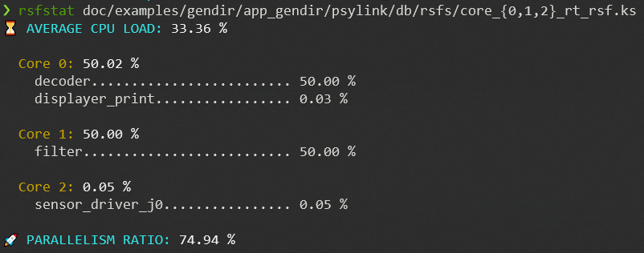

# ⏳ *rsfstat* - ASTERIOS Application Scheduling Plans Stats


## Installation

*rsfstat* is tested for Python 3.7 or above, and is currently only compatible
with Applications compiled with **ASTERIOS Developer K19.2** (*psyko* versions
from 8.2.0 up to 8.19.0).

*rsfstat* is not deployed on PyPi, so you need to install it from the
repository:

```bash
pip install --user git+https://github.com/krono-safe/rsfstat.git
```

Of if you use [pipx][3]

```bash
pipx install git+https://github.com/krono-safe/rsfstat.git
```

A note to Windows users: you should use a terminal emulator that supports
unicode characters, such as [Windows Terminal][1] or [ConEmu][2]. You'd be
missing emojis in your console output otherwise! 😉


## Features Overview

This is a free an open-source tool developed by [**Krono-Safe**][6], to be used
along with our commercial toolsuite **ASTERIOS Developer** and its associated
Real-Time Kernels.

*rsfstat* is a CLI tool written in Python that compute some interesting stats on
the static scheduling plans generated for an ASTERIOS Application. Run it on the
binary files `core_<N>_rt_rsf.ks` created under `app_gendir/psylink/db/rsfs/`in
your generation directory _(where `<N>` is a CPU identifier)_. A set of examples
is available in this repository for you to test the tool:

```bash
# An Application that maps Tasks on 3 different cores has 3 RSFs:
rsfstat doc/examples/gendir/app_gendir/psylink/db/rsfs/core_{0,1,2}_rt_rsf.c
```

Here's the expected output:



> **⚠ WARNING**: The values computed by the tool are correct only if the quota
> timers have the same frequency across all cores.


### CPU Load

*rsfstat* prints out three types of CPU load:

* a global CPU load computed on all cores;
* a CPU load computed separately for each core;
* a CPU load computed for each Task mapped on a given core.

Note that these values are computed _only on the periodic part_ (a.k.a. "loop")
of the static scheduling plans (RSFs), ignoring the transient state occurring at
initialization.

### Parallelism Ratio

*rsfstat* also computes a normalized "parallelism ratio", such that:

1. it equals 0 iff. at any given time in steady state, at most one Task is
   scheduled among all the RSFs;
2. it equals 1 iff. at any given time in steady state, either **all** the RSFs
   schedule a Task, or **no** RSF schedules a Task (i.e. all cores are idling);
3. given a certain timeslot, it increases linearly with the number of cores
   executing a Task during that slot.

The parallelism ratio can be expressed mathematically as follows:


where:

* `T_{RSF}` is the length of the loop of the RSFs *(all RSFs of the same
  Application have the same loop length by construction)*;
* `N` is the number of active cores *(and thus the number of RSFs)*
* `L_{global}` is the global CPU load computed on all the loops of all the RSFs
  of the Application;
* by convention `t=0` corresponds to the date when the last RSF starts its steady
  state, i.e. starts executing its loop;
* `\delta^{k}(t)` is valued for any `t` in `[0, T_{RSF}]` to 1 if a Task is
  scheduled on the `k`-th RSF at date `t`, and 0 otherwise.

A few examples give a quicker understanding of that ratio. Consider for instance
the scheduling plans for two cores *(for the sake of brevity, only the "loop"
part of the RSFs is represented)*, as represented below:


Tasks are always scheduled to be executed simultaneously *(colored blocks)*,
and both cores are also idling at the same time. Thus, the global CPU load is of
60% (as each core has a 60% load), but the parallelism ratio is of 100%.

The next case below is the exact opposite:


No Tasks are executed simultaneously _ever_: the CPU load of each core is of
50%, so is the global CPU load, and the parallelism ratio is 0.

As a last example, the case below is an in-between: sometimes Tasks are executed
simultaneously *(for 2 time units per cycle)*, but most of the time they are not
*(there are 7 time units per cycle where only one Task is executed while the
other core is idling)*:


## For developers

The issue tracker of this project is closed, but contributions are welcome: do
not hesitate to submit a pull-request!

Install extra dependencies to develop:

```sh
pip install "rsfstat[dev]"
```

Run tests with [pytest][4]:

```sh
# from the project root directory
pytest
```

This project uses [bump2version][5]: run this e.g. to bump the minor version
number, create and commit a tag:

```shell
bump2version minor
```

See `setup.cfg` for the configuration of *bump2version*.

[1]: https://aka.ms/terminal
[2]: https://conemu.github.io/ 
[3]: https://github.com/pypa/pipx
[4]: https://docs.pytest.org/
[5]: https://github.com/c4urself/bump2version
[6]: https://www.krono-safe.com
